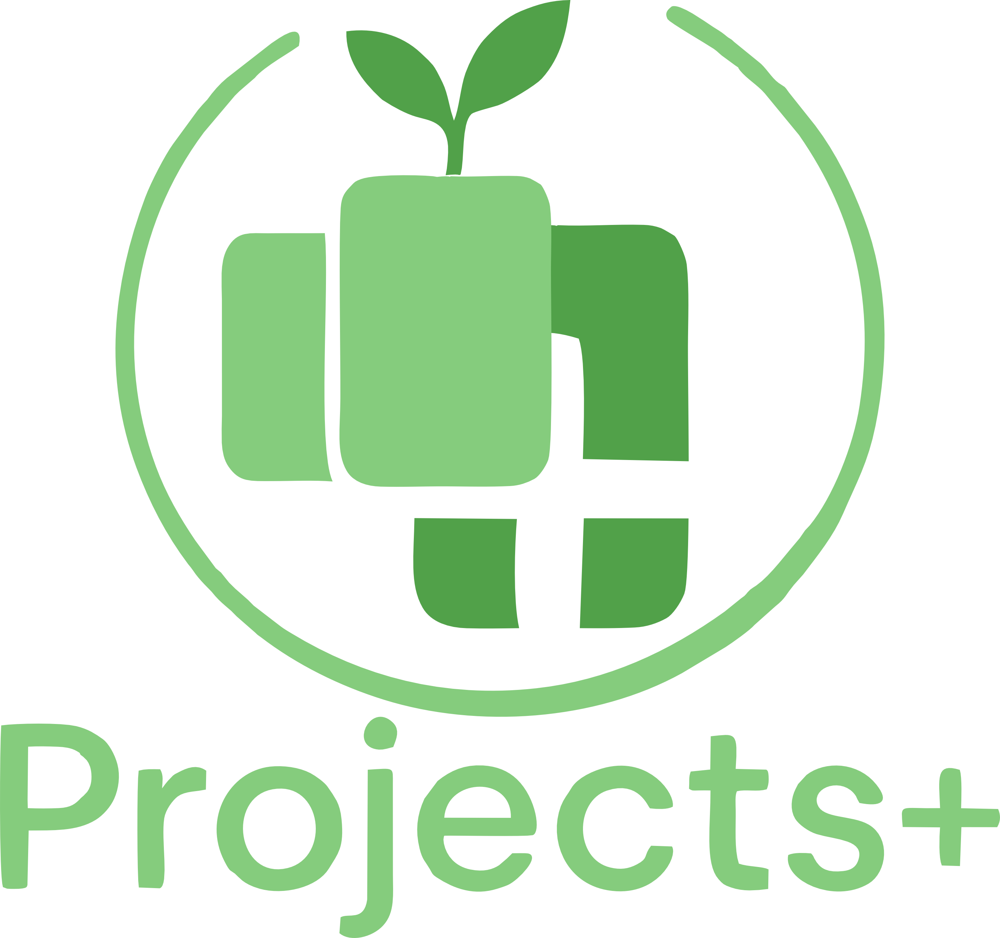

# Projects Plus

> **Современный визуальный проектный менеджер для Obsidian**  
> Улучшенная версия популярного плагина obsidian-projects с расширенными возможностями и современным дизайном.


[](https://github.com/ParkPavel/Projects-plus/releases)
[](https://opensource.org/licenses/Apache-2.0)

## 🚀 О проекте

**Projects Plus** — это современный плагин для Obsidian, предназначенный для визуальной организации проектов, задач и информации. Основан на архитектуре [obsidian-projects](https://github.com/marcusolsson/obsidian-projects) от Marcus Olsson, но полностью переосмыслен с учетом современных потребностей пользователей.

### ✨ Ключевые особенности

- **🎨 Современный UI/UX** — минималистичный дизайн с акцентом на эстетику
- **🔧 Гибкая настройка** — расширенные возможности кастомизации отображения
- **📱 Кроссплатформенность** — адаптация под все устройства
- **🎯 Без метатегов** — проектная логика без загрязнения заметок
- **🌈 Совместимость с темами** — универсальная адаптация к темам сообщества
- **🔗 Интеграция с плагинами** — поддержка Full Calendar, Day Planner, Omnisearch

## 🎯 Цели проекта

### Текущие задачи
- Улучшенная визуальная организация проектов и задач
- Расширенные настройки фильтрации и отображения
- Интуитивная и адаптивная рабочая среда
- Совместимость с будущими обновлениями Obsidian

### Планы развития
- Командная работа с проектами
- Мобильные виджеты
- Расширенная интеграция с экосистемой Obsidian
- AI-ассистент для управления проектами

## 📦 Установка

### Из Community Store (скоро)
1. Откройте настройки Obsidian
2. Перейдите в Community Plugins
3. Найдите "Projects Plus"
4. Установите и активируйте

### Ручная установка
1. Скачайте последний релиз из [Releases](https://github.com/ParkPavel/Projects-plus/releases)
2. Распакуйте в папку `.obsidian/plugins/projects-plus/`
3. Перезапустите Obsidian
4. Активируйте плагин в настройках

## 🎬 Быстрый старт

1. **Создайте проект**: Откройте Command Palette (`Ctrl+P`) → "Projects Plus: Create Project"
2. **Добавьте заметки**: Перетащите заметки в проект или используйте теги
3. **Настройте отображение**: Выберите вид (Kanban, Table, Gallery, Calendar)
4. **Кастомизируйте**: Настройте цвета, поля и фильтры

## 📖 Документация

- [Руководство пользователя](docs/user-guide.md)
- [API для разработчиков](docs/api.md)
- [Миграция с obsidian-projects](docs/migration.md)
- [Troubleshooting](docs/troubleshooting.md)

## 🤝 Вклад в проект

Мы приветствуем любой вклад! Пожалуйста, ознакомьтесь с [Contributing Guidelines](CONTRIBUTING.md) перед началом работы.

### Способы помочь проекту:
- 🐛 Сообщайте о багах
- 💡 Предлагайте новые функции
- 🔧 Участвуйте в разработке
- 📖 Улучшайте документацию
- 🌍 Помогайте с переводами

## 🏆 Атрибуция и благодарности

Этот проект основан на [obsidian-projects](https://github.com/marcusolsson/obsidian-projects) — выдающемся плагине от **Marcus Olsson**. Мы глубоко благодарны за его вклад в сообщество Obsidian и за создание основы, которая вдохновила Projects Plus.

**Особая благодарность:**
- **Marcus Olsson** — создатель оригинального obsidian-projects
- Сообществу Obsidian за тестирование и обратную связь
- Всем контрибьюторам проекта

## 📄 Лицензия

Проект лицензирован под [Apache License 2.0](LICENSE) — той же лицензией, что и оригинальный obsidian-projects.

```
Licensed under the Apache License, Version 2.0 (the "License");
you may not use this file except in compliance with the License.
You may obtain a copy of the License at

    http://www.apache.org/licenses/LICENSE-2.0

Unless required by applicable law or agreed to in writing, software
distributed under the License is distributed on an "AS IS" BASIS,
WITHOUT WARRANTIES OR CONDITIONS OF ANY KIND, either express or implied.
See the License for the specific language governing permissions and
limitations under the License.
```

## 🔗 Связь с автором

**Пак Павел** — создатель Projects Plus
- 🌐 Сайт: [parkpavel.github.io](https://parkpavel.github.io/park-pavel/)
- 📧 GitHub: [@ParkPavel](https://github.com/ParkPavel)
- 💼 Массажист, Тренер по Йоге и Цигун, фотограф и художник.
---

<div align="center">

**Сделано с ❤️ для сообщества Obsidian**

[⭐ Поставьте звезду](https://github.com/ParkPavel/Projects-plus) | [🐛 Сообщить о проблеме](https://github.com/ParkPavel/Projects-plus/issues) | [💡 Предложить идею](https://github.com/ParkPavel/Projects-plus/discussions)

</div>